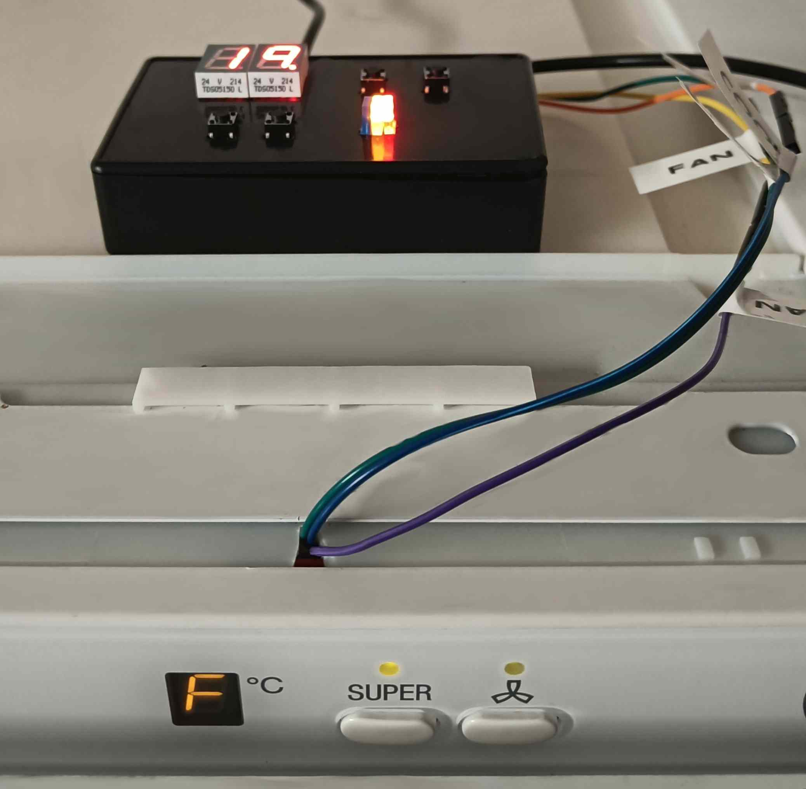
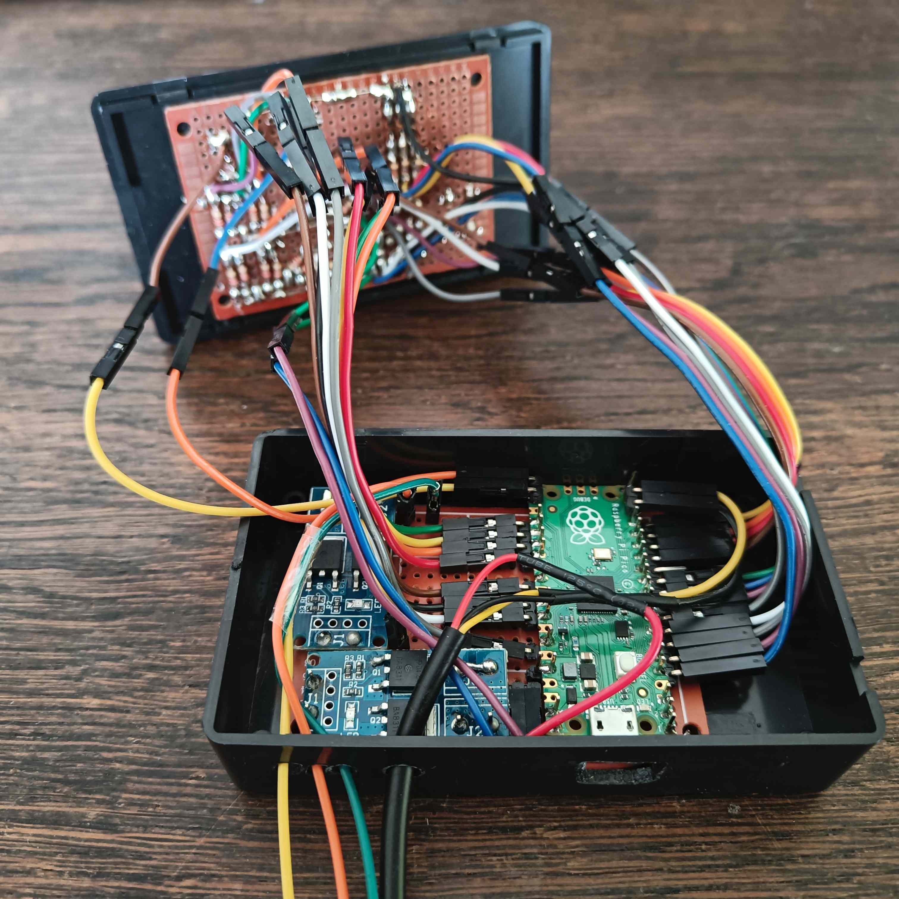

# Simple Temperature Controller

This is a simple project to control some outputs by the value of a temperature sensor with MircoPython on a Raspberry Pi Pico. In normal operation the actual temperature of the temperature sensor is shown on the two 7-segment displays. Additionally, the current state (e.g. currently cooling or not) is shown using three LEDs. The threshold value for the desired temperature can be set with two push buttons. 

The python code is used for controlling a refrigerator as well as a simple aquarium cooler and you can find the code for both on the GitHub repository.

[See project on GitHub](https://github.com/lm4552/simple_temp_controller)

## Refrigerator Controller

I used this project to control an old refrigerator which did not properly cool anymore. However, the refigerator had a manual button for activating the cooling which still worked. So I simply interfaced this button and put a temperature sensor inside the fridge. For interfacing the button I had to use some MOSFET modules because I did not have other components available.  

### Schematic
 

### Images

||
|---|
|Old fridge wired to the controller on top|

||
|---|
|Open case of the controller with both stripboards |

## Aquarium Cooler
